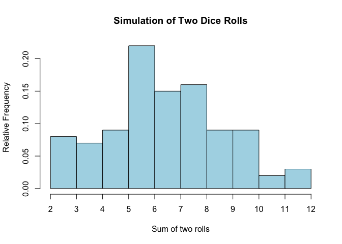

# Exploratory Analysis Exercises   

## Simulating Dice Rolls

  * Simulate a 2 die roll for 100 trials
  * Plot a histogram of the results
    + Use relative frequency instead of count
    + Add color and formatting to the histogram plot
    + Add an axis to include all values between 2:12


In order to create a simulation of dice rolls we use sample() to take a random sample of integers between 1 and 6.  If an analysis were to be run at different times or by various individuals it could be extremely tedious if the results were always different.  Although replication is not an issue with this exercise, we use set.seed so that the analysis will always produce the same results.

```r
set.seed(98250)
```

Create a dataframe of NA's that will house the dice trials.  Each trial will have a value for roll 1, roll 2, and a total of both rolls.  Thus, we need 3 columns and we'll run 100 trials. 

```r
rolls <- data.frame(matrix(NA,ncol=3,nrow=100))   
names(rolls) <- c("roll1","roll2","Total")
```

For rolls 1 and 2, use sample() to pick a number between 1 and 6 for 100 trials.  Every time we roll the die all 6 sides are available which means that we need to set replace to true.  Otherwise, if we roll a three on the first trial it would not be included in the sample set for the following rolls.

```r
rolls$roll1 <- sample(x=c(1:6) , size=100 , replace=TRUE)
rolls$roll2 <- sample(x=c(1:6) , size=100 , replace=TRUE)
rolls$Total <- rolls$roll1+rolls$roll2

rolls$Total <- as.numeric(rolls$Total)
```


To visualize the data we create a histogram.  The bins are expliclity states using breaks=.

```r
hist(rolls$Total,
#      breaks=10,
     breaks=c(seq(2,12,1)),
     main="Simulation of Two Dice Rolls",
     xlab="Sum of two rolls",
     ylab="Relative Frequency",
     col="lightblue",
     xaxt="n",
     freq=FALSE
)
axis(side=1, at=seq(2,12,by=1))
```

 


## Analyzing Philly Dropout Data available from 

Data obtained from https://www.opendataphilly.org/dataset/schools

* Load the file Philly_Dropout_Data.csv
* Remove the following columns: (2,3,4,6)
* Name the columns:
    + County FACTOR
    + School CHARACTER
    + Enrollments INTEGER
    + maleDropouts INTEGER
    + femaleDropouts INTEGER
    + dropoutRate NUMERIC
* Data from opendataphilly.org


```r
data <- read.csv("http://goo.gl/FieXmC")
data <- data[,c(-2,-3,-4,-6)]
names(data) <- c("county","school","enrollments","maleDropouts","femaleDropouts","dropouts","dropoutRate")

data$county <- as.factor(data$county)
data$school <- as.character(data$school)

str(data)
```

```
## 'data.frame':	1650 obs. of  7 variables:
##  $ county        : Factor w/ 67 levels "Adams","Allegheny",..: 1 1 1 1 1 1 1 1 1 1 ...
##  $ school        : chr  "Bermudian Springs HS" "Bermudian Springs MS" "New Oxford SHS" "New Oxford MS" ...
##  $ enrollments   : int  645 317 1244 613 1 0 394 195 495 1037 ...
##  $ maleDropouts  : int  3 0 7 0 0 1 2 0 0 6 ...
##  $ femaleDropouts: int  2 0 11 0 0 2 1 0 0 7 ...
##  $ dropouts      : int  5 0 18 0 0 3 3 0 0 13 ...
##  $ dropoutRate   : num  0.78 0 1.45 0 0 NA 0.76 0 0 1.25 ...
```

  * Remove missing values from the dataset


```r
#data <- data[!is.na(data),]
data <- na.omit(data)
summary(data)
```

```
##           county       school           enrollments    maleDropouts 
##  Philadelphia:242   Length:1596        Min.   :   1   Min.   :   0  
##  Allegheny   :147   Class :character   1st Qu.: 142   1st Qu.:   0  
##  Montgomery  : 68   Mode  :character   Median : 396   Median :   0  
##  York        : 57                      Mean   : 514   Mean   :   5  
##  Bucks       : 55                      3rd Qu.: 680   3rd Qu.:   3  
##  Chester     : 49                      Max.   :7291   Max.   :1244  
##  (Other)     :978                                                   
##  femaleDropouts      dropouts       dropoutRate   
##  Min.   :   0.0   Min.   :   0.0   Min.   :  0.0  
##  1st Qu.:   0.0   1st Qu.:   0.0   1st Qu.:  0.0  
##  Median :   0.0   Median :   0.0   Median :  0.0  
##  Mean   :   3.6   Mean   :   8.6   Mean   :  2.4  
##  3rd Qu.:   2.0   3rd Qu.:   6.0   3rd Qu.:  1.2  
##  Max.   :1023.0   Max.   :2267.0   Max.   :400.0  
## 
```

* Show descriptive statistitcs for the dataset.
* Create a table that aggregates enrollments, dropouts,maleDropouts,femaleDropouts by county


```r
# describe(data[,c(1,4:7)])

aggData <- data.frame(aggregate(cbind(enrollments,dropouts,maleDropouts,femaleDropouts)~county,data=data,sum))
str(aggData)
```

```
## 'data.frame':	67 obs. of  5 variables:
##  $ county        : Factor w/ 67 levels "Adams","Allegheny",..: 1 2 3 4 5 6 7 8 9 10 ...
##  $ enrollments   : int  6682 70102 4906 18271 3502 31765 8155 4380 43338 12362 ...
##  $ dropouts      : int  61 567 78 695 30 599 86 75 221 80 ...
##  $ maleDropouts  : int  30 340 45 347 19 356 51 42 135 54 ...
##  $ femaleDropouts: int  31 227 33 348 11 243 35 33 86 26 ...
```

```r
head(aggData);tail(aggData)
```

```
##      county enrollments dropouts maleDropouts femaleDropouts
## 1     Adams        6682       61           30             31
## 2 Allegheny       70102      567          340            227
## 3 Armstrong        4906       78           45             33
## 4    Beaver       18271      695          347            348
## 5   Bedford        3502       30           19             11
## 6     Berks       31765      599          356            243
```

```
##          county enrollments dropouts maleDropouts femaleDropouts
## 62       Warren        2419       46           25             21
## 63   Washington       13370      120           77             43
## 64        Wayne        2359       23           15              8
## 65 Westmoreland       23222      185          129             56
## 66      Wyoming        1728       24           15              9
## 67         York       31661      314          185            129
```

* Compute the average, min, max dropout rate per county omitting schools with 0 dropout rates

```r
newData <- data[data$dropouts>0,]
newData <- data[data$dropouts<100,]


countyMed <- aggregate(dropouts~county,data=newData,mean)
countyMin <- aggregate(dropouts~county,data=newData,min)
countyMax <- aggregate(dropouts~county,data=newData,max)

(dropData <- cbind(countyMin,countyMed$dropouts,countyMax$dropouts))
```

```
##            county dropouts countyMed$dropouts countyMax$dropouts
## 1           Adams        0             4.0667                 18
## 2       Allegheny        0             3.8571                 41
## 3       Armstrong        0             6.5000                 21
## 4          Beaver        0             2.5455                 11
## 5         Bedford        0             2.5000                 11
## 6           Berks        0             7.4681                 99
## 7           Blair        0             5.0588                 47
## 8        Bradford        0             8.3333                 25
## 9           Bucks        0             4.0182                 40
## 10         Butler        0             4.7059                 27
## 11        Cambria        0             2.1304                 16
## 12        Cameron        7             7.0000                  7
## 13         Carbon        0             2.0000                 12
## 14         Centre        0             4.1818                 17
## 15        Chester        0             5.1277                 52
## 16        Clarion        0             2.1111                  6
## 17     Clearfield        0             6.2857                 32
## 18        Clinton        0             4.8000                 21
## 19       Columbia        0             5.2000                 49
## 20       Crawford        0             5.4000                 24
## 21     Cumberland        0             5.7143                 31
## 22        Dauphin        0             6.4865                 63
## 23       Delaware        0             5.4091                 40
## 24            Elk        0             3.8333                 11
## 25           Erie        0             7.4048                 66
## 26        Fayette        0             8.7368                 51
## 27         Forest        2             2.0000                  2
## 28       Franklin        0             5.4615                 29
## 29         Fulton        0             3.2500                  7
## 30         Greene        0             2.2000                  6
## 31     Huntingdon        0             4.1111                 17
## 32        Indiana        0             2.8571                 13
## 33      Jefferson        0             6.3333                 19
## 34        Juniata        0             0.3333                  1
## 35     Lackawanna        0             4.9200                 61
## 36      Lancaster        0             6.9333                 57
## 37       Lawrence        0             2.3125                  9
## 38        Lebanon        0             9.0714                 52
## 39         Lehigh        0             8.1562                 76
## 40        Luzerne        0             7.8788                 98
## 41       Lycoming        0             7.5333                 59
## 42         McKean        0             4.3750                 16
## 43         Mercer        0             2.7500                 21
## 44        Mifflin        0            10.3333                 26
## 45         Monroe        0            10.8750                 44
## 46     Montgomery        0             5.0000                 38
## 47        Montour        0             4.5000                  9
## 48    Northampton        0             9.0000                 63
## 49 Northumberland        0             4.2353                 33
## 50          Perry        0             3.3000                 18
## 51   Philadelphia        0             4.8319                 84
## 52           Pike        0             5.6667                 19
## 53         Potter        0             1.3750                  6
## 54     Schuylkill        0             5.1364                 31
## 55         Snyder        0             7.8000                 22
## 56       Somerset        0             1.4091                 13
## 57       Sullivan        2             2.0000                  2
## 58    Susquehanna        0             2.5455                  9
## 59          Tioga        0             6.1429                 11
## 60          Union        0             3.0000                  7
## 61        Venango        0             4.9000                 19
## 62         Warren        0             6.5714                 25
## 63     Washington        0             3.8710                 32
## 64          Wayne        0             3.2857                 11
## 65   Westmoreland        0             3.8542                 31
## 66        Wyoming        0             8.0000                 20
## 67           York        0             5.5088                 55
```

* Create a boxplot comparing male dropouts and female dropouts using the new dataset

```r
newData <- data[data$dropouts>5&data$dropouts<100,]

boxplot(cbind(newData$maleDropouts,newData$femaleDropouts) , xaxt="n", 
        ylab="Number of Dropouts",
        main="Number of Dropouts by Gender")
axis(side=1, at=c(1,2) , labels=c("Male","Female"))
```

 


