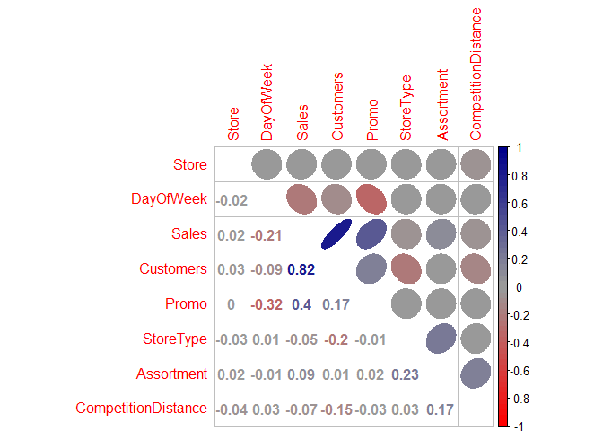
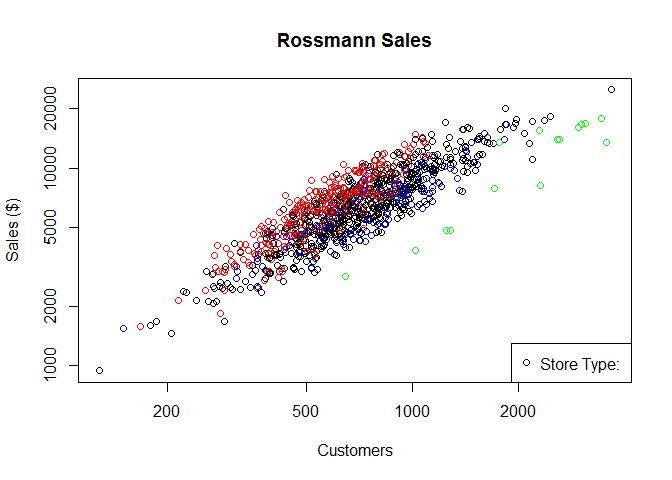
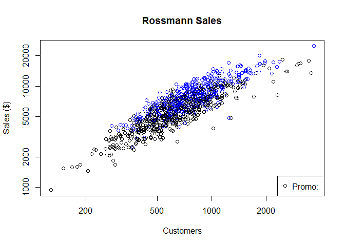
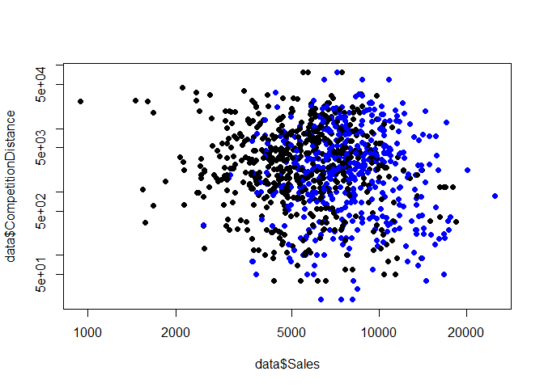

# C&F Chapter 4 Exercises
Pawel Bogdanowicz  
January 28, 2016  


### Rossmann Store Sales Exploratory Analysis Exercise
This exercise is based on the Kaggle competition "Rossmann Store Sales"
The data can be found here: https://www.kaggle.com/c/rossmann-store-sales/data

The first part merges select variables from store.csv and train.csv.  From previous knowledge of the dataset, rows with sales = 0 just add noise to the dataset and are removed.

* This part creates a dataset that can be used for these exercises.  Ideally if this code is reproduced, either the two csv files or the final file can be provided.


```r
setwd("C:/Users/Pawel PC/Google Drive/School (1)/Independent Study/C&F/C&F Exercies")

train <- read.csv("http://goo.gl/Zlr24r")
store <- read.csv("http://goo.gl/MtLCTf")

# Not judged on sales with 0 sales - remove from train dataset
# Remove rows where sales are greater than 0
train <- train[train$Sales > 0,]  

# Merge the train and test data sets with store by the column "Store"
train <- merge(train,store,by="Store")
raw <- train[,c(1,2,4,5,7,10,11,12)]
raw[is.na(raw$CompetitionDistance),8] <- mean(raw$CompetitionDistance)

# Take a random sample of 1000 rows just to make the code a bit quicker
data <- raw[sample(1:nrow(raw) , 1000 , replace=FALSE),]
rm(raw,store,train)
```

### 1
1) Use the data provided to create a corrplot of all of the variables.


```r
library(corrplot)
```

```
## Warning: package 'corrplot' was built under R version 3.1.3
```

```r
library(gplots)
```

```
## Warning: package 'gplots' was built under R version 3.1.3
```

```
## KernSmooth 2.23 loaded
## Copyright M. P. Wand 1997-2009
```

```
## 
## Attaching package: 'gplots'
```

```
## The following object is masked from 'package:stats':
## 
##     lowess
```

```r
data$StoreType <- as.numeric(data$StoreType)
data$Assortment <- as.numeric(data$Assortment)

corrplot.mixed(corr=cor((data) , use="complete.obs")
               , upper="ellipse"
               , tl.pos="lt"
               , col=colorpanel(50,"red","gray60","blue4"))
```

<!-- -->

The correlation plot shows that there is some correlation
* DayOfWeek ~ Sales + Promo
* Sales ~ Customers + Promo
* Customers ~ StoreType + CompetitionDistance
* StoreType ~ Assortment

There is obvious positive correlation between customers and sales, which intuitively checks out.

### 2 
2) Make two plots Sales by Customers and color the points by store type and promo
* Use a log scale
* Add appropriate axis labels, title, legend


```r
col.p1 <- c("black" , "green" , "blue" , "red")

plot( data$Customers , data$Sales
     , log="xy"
     , pch=c(1)
     , col=col.p1[data$StoreType] 
     , xlab="Customers"
     , ylab="Sales ($)"
     , main="Rossmann Sales")
legend(x="bottomright" , legend=paste("Store Type:" , levels(data$StoreType)) , col=col.p1 , pch=c(1) )
```

<!-- -->

```r
col.p2 <- c("black","blue" )

plot( data$Customers , data$Sales
     , log="xy"
     , pch=c(1)
     , col=col.p2[data$Promo+1] 
     , xlab="Customers"
     , ylab="Sales ($)"
     , main="Rossmann Sales")
legend(x="bottomright" , legend=paste("Promo:" , levels(data$Promo)) , col=col.p2 , pch=c(1) )
```

<!-- -->

### 3 
Plot Sales by Competition and use promo as color
* Use a log scale
* Add appropriate axis labels, title, legend


```r
col.p3 <- c("black","blue")
plot(data$Sales,data$CompetitionDistance,log="xy",col=col.p3[data$Promo+1],pch=c(19))
```

<!-- -->


### 4
1) Determine the correlation between Sales and Promo/StoreType/CompetitionDistance


```r
cor.test(data$Sales , data$StoreType)
```

```
## 
## 	Pearson's product-moment correlation
## 
## data:  data$Sales and data$StoreType
## t = -1.7138, df = 998, p-value = 0.08687
## alternative hypothesis: true correlation is not equal to 0
## 95 percent confidence interval:
##  -0.115774763  0.007848967
## sample estimates:
##         cor 
## -0.05417047
```

```r
cor.test(data$Sales , data$Promo)
```

```
## 
## 	Pearson's product-moment correlation
## 
## data:  data$Sales and data$Promo
## t = 14.0125, df = 998, p-value < 2.2e-16
## alternative hypothesis: true correlation is not equal to 0
## 95 percent confidence interval:
##  0.3523257 0.4559940
## sample estimates:
##       cor 
## 0.4054627
```

```r
cor.test(data$Sales , data$CompetitionDistance)   # Why does cor.test return value but cor return NA?
```

```
## 
## 	Pearson's product-moment correlation
## 
## data:  data$Sales and data$CompetitionDistance
## t = -2.0637, df = 992, p-value = 0.03931
## alternative hypothesis: true correlation is not equal to 0
## 95 percent confidence interval:
##  -0.127045827 -0.003215431
## sample estimates:
##         cor 
## -0.06538234
```

These tests show that the correlation for Sales and Promo is 0.38 and is statistically significant.

2) Transform Sales using Box-Cox Transformations and test the same correlations as in (1)


```r
library(car)
```

```
## Warning: package 'car' was built under R version 3.1.3
```

```r
l.sales <- coef(powerTransform(data$Sales))
l.comp <- coef(powerTransform(data$CompetitionDistance))

cor.test(bcPower(data$Sales,l.sales) , data$StoreType)
```

```
## 
## 	Pearson's product-moment correlation
## 
## data:  bcPower(data$Sales, l.sales) and data$StoreType
## t = -0.9256, df = 998, p-value = 0.3549
## alternative hypothesis: true correlation is not equal to 0
## 95 percent confidence interval:
##  -0.09111493  0.03276529
## sample estimates:
##         cor 
## -0.02928728
```

```r
cor.test(bcPower(data$Sales,l.sales) , data$Promo)
```

```
## 
## 	Pearson's product-moment correlation
## 
## data:  bcPower(data$Sales, l.sales) and data$Promo
## t = 15.2378, df = 998, p-value < 2.2e-16
## alternative hypothesis: true correlation is not equal to 0
## 95 percent confidence interval:
##  0.3827631 0.4834206
## sample estimates:
##       cor 
## 0.4344474
```

```r
cor.test(bcPower(data$Sales,l.sales) , bcPower(data$CompetitionDistance , l.comp))
```

```
## 
## 	Pearson's product-moment correlation
## 
## data:  bcPower(data$Sales, l.sales) and bcPower(data$CompetitionDistance, l.comp)
## t = -3.0526, df = 992, p-value = 0.002329
## alternative hypothesis: true correlation is not equal to 0
## 95 percent confidence interval:
##  -0.1577006 -0.0344935
## sample estimates:
##         cor 
## -0.09646658
```

Using the power transform, storetype is still not statistically correlated. 
Promo became more correlated with pearsons going from 0.38 to 0.42.
CompetitionDistance became correlated. Before the transform it had a coefficient of -0.05 and not statistically significant (p-value=0.16).  After the transform, the coefficient became -0.07 with a p-value of 0.02.


