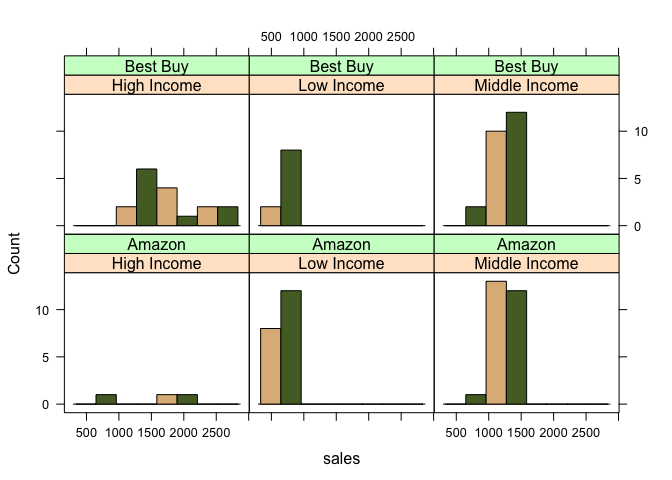

# Simulating and comparing data


* Variables
    + Marketing Channel:  Best Buy & Amazon
    + Returns: Yes/No
    + Sales: continuous ($)
    + Gender: Male/Female
    + Age: integer 


```r
set.seed(19104)

vars <- c("marketing.channel","returns","sales","gender","age")
varTypes <- c("binom","binom","norm","binom","norm")

segNames <- c("High Income","Middle Income","Low Income")
segSize <- c(20,50,30)

segMeans <- matrix(c(
    0.7 , 0.1 , 1800 , 0.7 , 52
  , 0.5 , 0.15 , 1200 , 0.5 , 40
  , 0.3 , 0.2 , 700 , 0.3 , 28 
  ) , ncol=length(vars),byrow=TRUE)

segSDs <- matrix( c(
    NA , NA , 500  , NA , 5
  , NA , NA , 150  , NA , 4
  , NA , NA , 100 , NA , 2
  ) , ncol=length(vars),byrow=TRUE)

data <- NULL

for ( i in seq_along(segNames)) {
  cat(i,segNames[i] , "\n")
  
  this.seg <- data.frame(matrix(NA,nrow=segSize[i],ncol=length(vars)))
  
  for(j in seq_along(vars)) {
    if (varTypes[j] == "norm") {
      this.seg[,j] <- rnorm(segSize[i], mean=segMeans[i,j],sd=segSDs[i,j])
      } else if (varTypes[j] == "pois") {
        this.seg[,j] <- rpois(segSize[i] , lambda=segMeans[i,j])
      } else if (varTypes[j] == "binom") {
        this.seg[,j] <- rbinom(segSize[i] , size=1 , prob=segMeans[i,j])
      }  else {
        stop("Bad Segment Data Type: " , varTypes[j])
      }
  }
  data <- rbind(data,this.seg)
}
```

```
## 1 High Income 
## 2 Middle Income 
## 3 Low Income
```

```r
names(data) <- vars
data$segment <- factor(rep(segNames,times=segSize))

data$marketing.channel <- factor(data$marketing.channel , labels=c("Amazon","Best Buy"))
data$returns <- factor(data$returns , labels=c("Yes","No"))
data$gender <- factor(data$gender , labels=c("Male","Female"))


summary(data)
```

```
##  marketing.channel returns      sales         gender        age      
##  Amazon  :49       Yes:78   Min.   : 427   Male  :55   Min.   :25.3  
##  Best Buy:51       No :22   1st Qu.: 802   Female:45   1st Qu.:30.4  
##                             Median :1183               Median :39.2  
##                             Mean   :1177               Mean   :39.1  
##                             3rd Qu.:1397               3rd Qu.:44.4  
##                             Max.   :2741               Max.   :61.1  
##           segment  
##  High Income  :20  
##  Low Income   :30  
##  Middle Income:50  
##                    
##                    
## 
```


### 2
#### Create data tables

Using the aggregate function to show means/sums as appropriate for age, returns, sales, by segment and marketing channel.  


```r
aggregate( age ~ segment + marketing.channel , data=data , mean)
```

```
##         segment marketing.channel   age
## 1   High Income            Amazon 51.41
## 2    Low Income            Amazon 28.31
## 3 Middle Income            Amazon 40.23
## 4   High Income          Best Buy 53.05
## 5    Low Income          Best Buy 28.96
## 6 Middle Income          Best Buy 39.67
```

```r
aggregate( as.numeric(returns) ~ segment + marketing.channel , data=data , sum)
```

```
##         segment marketing.channel as.numeric(returns)
## 1   High Income            Amazon                   3
## 2    Low Income            Amazon                  25
## 3 Middle Income            Amazon                  28
## 4   High Income          Best Buy                  19
## 5    Low Income          Best Buy                  15
## 6 Middle Income          Best Buy                  32
```

```r
aggregate( sales ~ segment + marketing.channel, data=data , sum)
```

```
##         segment marketing.channel sales
## 1   High Income            Amazon  4695
## 2    Low Income            Amazon 13499
## 3 Middle Income            Amazon 31906
## 4   High Income          Best Buy 29828
## 5    Low Income          Best Buy  7301
## 6 Middle Income          Best Buy 30512
```

### 3
#### Create a histogram that shows the distribution of sales by segment and marketing channel


```r
library(lattice)

histogram(
  ~sales | segment + marketing.channel
  , data=data
  , type="count"
  , layout=c(3,2)
  , col=c("burlywood","darkolivegreen")
  )
```

 

### 4
#### Show a boxplot of sales by segment


```r
boxplot( sales~segment , data=data , yaxt="n" , ylab="Sales")
ax.seq <- seq(from=0 , to=5000 , by=250)
axis(side=2 , at=ax.seq , labels=paste(ax.seq/1000 , "k" , sep="") , las=1)
```

 


