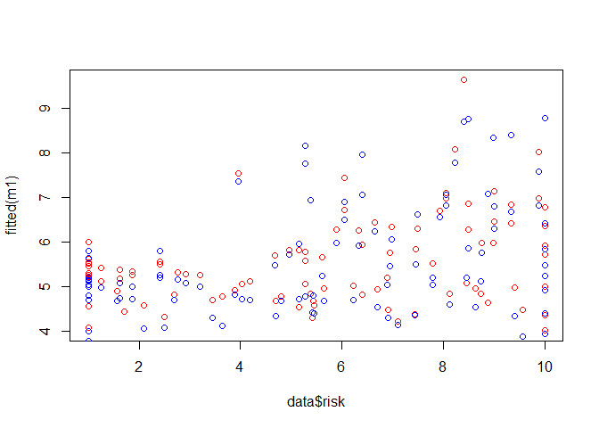

# C&F Chapter 7 Exercises
Pawel Bogdanowicz  
Tuesday, February 16, 2016  

height weight bmi smoking active/notactive gender 

Create the data for the exercises


```r
library(data.table)
```

```
## Warning: package 'data.table' was built under R version 3.1.3
```

```r
set.seed(2)

N <- 100 # 100 Patients

data = data.table(matrix(rep(NA,600),nrow=100,ncol=8))
setnames(data,colnames(data),c("gender"
                               ,"activityLevel"
                               ,"height"
                               ,"weight"
                               ,"bmi"
                               ,"smoker"
                               ,"age"
                               ,"risk"))

data$gender <- factor(ifelse(rbinom(N,1,0.5)==1,"female","male"))
data$activityLevel <- factor(sample(c(1,2,3),N,replace=TRUE))
data$smoker <- factor(ifelse(rbinom(N,1,0.1)==1,"yes","no"))

data$height[data$gender=="female"] <- rpois(length(data$gender[data$gender=="female"]),64)
data$height[data$gender=="male"] <- rpois(length(data$gender[data$gender=="male"]),69)

data$weight[data$gender=="female"] <- rpois(length(data$gender[data$gender=="female"]),150)
data$weight[data$gender=="male"] <- rpois(length(data$gender[data$gender=="male"]),180)

data$age <-  round(runif(N , min=18 , max=70))

data$bmi <- (data$weight / data$height^2)*703

data$risk <- ifelse(data$bmi >= 35 , rnorm(length(data$bmi[data$bmi>=35]),8,2) , 
                    ifelse(data$smoker=="yes",rnorm(length(data$smoker[data$smoker=="yes"]),8,2),
                           ifelse(data$bmi >= 25 & data$bmi < 30 , rnorm(length(data$bmi[data$bmi>=25 & data$bmi<30]),3,3) , NA)))
data$risk[is.na(data$risk)] <- rnorm(length(data$risk[is.na(data$risk)]),5,3)
data$risk <- ifelse(data$risk<1,1,ifelse(data$risk>10,10,data$risk))
```


#### Explore the dataset

Use gpairs 
* Do all of the variable seem to be normally distributed
    + Notice that height and weight (as expcted) may seem a little skewed
* Use corrplot
    + Notice that height and bmi seem to be very correlated (as expected) with a correlation coefficient of -0.85. When putting these into the linear model, we should expect that height will not be a significant variable and any variation should be sufficiently explained by bmi.  
    + However, because weight is also used in the bmi calculation, why does it not correlate more strongly with bmi?  This is due to the bmi formula.  Weight is divided by weight^2 and multiplied by 708.  Thus, the weight may be overshadowed by larger numbers.
    + Also notice that there is a correlation between bmi and risk with a correlation coefficient of -0.58.  This was expected as persons with a bmi over 35 are given a risk of one.  Why is this not a stronger coefficient then?  The factor smoker is also a strong predictor of risk.


```r
library(gpairs)
```

```
## Warning: package 'gpairs' was built under R version 3.1.3
```

```r
library(corrplot)
```

```
## Warning: package 'corrplot' was built under R version 3.1.3
```

```r
data <- data.frame(data)

gpairs(data)
```

```
## Loading required package: grid
```

```
## Loading required package: lattice
```

<!-- -->

```r
newdata <- data
newdata[,c(2:5,7:8)] <- sapply(data[,c(2:5,7:8)],as.numeric)

corrplot.mixed(cor(newdata[,c(2,3,4,5,7,8)]),upper="ellipse")
```

<!-- -->

```r
# Make all of the variables numeric and plot the new corrplot
newdata <- sapply(data,as.numeric)
corrplot.mixed(cor(newdata))
```

<!-- -->


#### Plot risk by bmi adding the line of best fit using abline


```r
m1 <- lm(risk ~ bmi , data=data)

plot(risk ~ bmi , data=data
     ,xlab="bmi",ylab="risk")
abline(m1,col='blue')
```

<!-- -->


#### Using the coefficient from the linear model, calculate the residuals and return a summary.  Confirm the calculated residuals using summary(model)


```r
residuals <- data$risk-(m1$coefficients[1]+data$bmi*m1$coefficients[2])

summary(residuals)
```

```
##    Min. 1st Qu.  Median    Mean 3rd Qu.    Max. 
## -4.9900 -2.6020  0.1854  0.0000  2.3150  5.9960
```

```r
summary(m1)
```

```
## 
## Call:
## lm(formula = risk ~ bmi, data = data)
## 
## Residuals:
##     Min      1Q  Median      3Q     Max 
## -4.9905 -2.6019  0.1854  2.3152  5.9964 
## 
## Coefficients:
##             Estimate Std. Error t value Pr(>|t|)   
## (Intercept)   2.1382     1.0734   1.992  0.04915 * 
## bmi           0.1181     0.0359   3.291  0.00139 **
## ---
## Signif. codes:  0 '***' 0.001 '**' 0.01 '*' 0.05 '.' 0.1 ' ' 1
## 
## Residual standard error: 2.923 on 98 degrees of freedom
## Multiple R-squared:  0.0995,	Adjusted R-squared:  0.09032 
## F-statistic: 10.83 on 1 and 98 DF,  p-value: 0.00139
```


* Summarize two linear models (bmi+smoker+heigher and bmi+smoker+bmiXsmoker

```r
m2 <- lm(risk ~ bmi + smoker + height, data=data)
summary(m2)
```

```
## 
## Call:
## lm(formula = risk ~ bmi + smoker + height, data = data)
## 
## Residuals:
##     Min      1Q  Median      3Q     Max 
## -4.7903 -2.5523  0.2447  2.1797  6.0752 
## 
## Coefficients:
##             Estimate Std. Error t value Pr(>|t|)  
## (Intercept)  7.16097    6.14656   1.165   0.2469  
## bmi          0.06574    0.06808   0.966   0.3366  
## smokeryes    2.24059    0.91672   2.444   0.0163 *
## height      -0.05727    0.06643  -0.862   0.3908  
## ---
## Signif. codes:  0 '***' 0.001 '**' 0.01 '*' 0.05 '.' 0.1 ' ' 1
## 
## Residual standard error: 2.846 on 96 degrees of freedom
## Multiple R-squared:  0.1635,	Adjusted R-squared:  0.1373 
## F-statistic: 6.253 on 3 and 96 DF,  p-value: 0.0006358
```

```r
m3 <- lm(risk ~ bmi + smoker + bmi*smoker , data=data  )
summary(m3)
```

```
## 
## Call:
## lm(formula = risk ~ bmi + smoker + bmi * smoker, data = data)
## 
## Residuals:
##     Min      1Q  Median      3Q     Max 
## -4.7572 -2.4288  0.2842  2.0097  5.9678 
## 
## Coefficients:
##               Estimate Std. Error t value Pr(>|t|)   
## (Intercept)    1.70763    1.09766   1.556  0.12307   
## bmi            0.12418    0.03676   3.378  0.00106 **
## smokeryes      4.87711    3.63824   1.341  0.18324   
## bmi:smokeryes -0.08686    0.12045  -0.721  0.47260   
## ---
## Signif. codes:  0 '***' 0.001 '**' 0.01 '*' 0.05 '.' 0.1 ' ' 1
## 
## Residual standard error: 2.849 on 96 degrees of freedom
## Multiple R-squared:  0.1615,	Adjusted R-squared:  0.1353 
## F-statistic: 6.165 on 3 and 96 DF,  p-value: 0.0007066
```


* M2 shows that smoker:yes is significant but the other tow variables are not.  From our earlier analysis and just conceptually we expected that BMI would be an important variables.  Why is BMI not significant any more?  Due to how the data was created (IF smokeryes=1 then risk=10), the model could be overfitting on smokeryes.


For M2 above, remove height and create two new models for M2 and M3 using the step function. Also compare the models to using all of the variables.  Compare the models and interpret the results.  Which model is best and interpret the model results.


```r
m4 <- step(lm(risk ~ bmi + smoker , data=data))
```

```
## Start:  AIC=211.88
## risk ~ bmi + smoker
## 
##          Df Sum of Sq    RSS    AIC
## <none>                783.66 211.88
## - smoker  1    53.446 837.10 216.48
## - bmi     1    89.286 872.94 220.67
```

```r
summary(m4)
```

```
## 
## Call:
## lm(formula = risk ~ bmi + smoker, data = data)
## 
## Residuals:
##     Min      1Q  Median      3Q     Max 
## -4.7256 -2.5128  0.2326  2.1586  5.8870 
## 
## Coefficients:
##             Estimate Std. Error t value Pr(>|t|)   
## (Intercept)  1.93987    1.04675   1.853  0.06689 . 
## bmi          0.11609    0.03492   3.324  0.00125 **
## smokeryes    2.33711    0.90865   2.572  0.01163 * 
## ---
## Signif. codes:  0 '***' 0.001 '**' 0.01 '*' 0.05 '.' 0.1 ' ' 1
## 
## Residual standard error: 2.842 on 97 degrees of freedom
## Multiple R-squared:  0.157,	Adjusted R-squared:  0.1396 
## F-statistic: 9.032 on 2 and 97 DF,  p-value: 0.0002527
```

```r
m5 <- step(lm(risk ~ bmi + smoker + bmi*smoker , data=data  ))
```

```
## Start:  AIC=213.34
## risk ~ bmi + smoker + bmi * smoker
## 
##              Df Sum of Sq    RSS    AIC
## - bmi:smoker  1    4.2219 783.66 211.88
## <none>                    779.44 213.34
## 
## Step:  AIC=211.88
## risk ~ bmi + smoker
## 
##          Df Sum of Sq    RSS    AIC
## <none>                783.66 211.88
## - smoker  1    53.446 837.10 216.48
## - bmi     1    89.286 872.94 220.67
```

```r
summary(m5)
```

```
## 
## Call:
## lm(formula = risk ~ bmi + smoker, data = data)
## 
## Residuals:
##     Min      1Q  Median      3Q     Max 
## -4.7256 -2.5128  0.2326  2.1586  5.8870 
## 
## Coefficients:
##             Estimate Std. Error t value Pr(>|t|)   
## (Intercept)  1.93987    1.04675   1.853  0.06689 . 
## bmi          0.11609    0.03492   3.324  0.00125 **
## smokeryes    2.33711    0.90865   2.572  0.01163 * 
## ---
## Signif. codes:  0 '***' 0.001 '**' 0.01 '*' 0.05 '.' 0.1 ' ' 1
## 
## Residual standard error: 2.842 on 97 degrees of freedom
## Multiple R-squared:  0.157,	Adjusted R-squared:  0.1396 
## F-statistic: 9.032 on 2 and 97 DF,  p-value: 0.0002527
```

```r
m6 <- lm(risk ~ ., data=data  )
summary(m6)
```

```
## 
## Call:
## lm(formula = risk ~ ., data = data)
## 
## Residuals:
##     Min      1Q  Median      3Q     Max 
## -4.5698 -1.9356 -0.2837  1.8424  5.3838 
## 
## Coefficients:
##                  Estimate Std. Error t value Pr(>|t|)    
## (Intercept)    -1.466e+01  8.912e+00  -1.645 0.103335    
## gendermale     -2.845e-01  9.416e-01  -0.302 0.763232    
## activityLevel2  9.932e-01  6.832e-01   1.454 0.149484    
## activityLevel3  2.365e+00  6.355e-01   3.722 0.000342 ***
## height          2.914e-01  1.279e-01   2.278 0.025090 *  
## weight         -7.294e-02  3.161e-02  -2.308 0.023286 *  
## bmi             4.277e-01  1.305e-01   3.277 0.001484 ** 
## smokeryes       1.945e+00  8.759e-01   2.220 0.028884 *  
## age            -3.369e-04  1.770e-02  -0.019 0.984853    
## ---
## Signif. codes:  0 '***' 0.001 '**' 0.01 '*' 0.05 '.' 0.1 ' ' 1
## 
## Residual standard error: 2.647 on 91 degrees of freedom
## Multiple R-squared:  0.3142,	Adjusted R-squared:  0.2539 
## F-statistic: 5.211 on 8 and 91 DF,  p-value: 2.255e-05
```

```r
summary(m2)$r.squared
```

```
## [1] 0.1634737
```

```r
summary(m3)$r.squared
```

```
## [1] 0.1615397
```

```r
summary(m4)$r.squared
```

```
## [1] 0.1569981
```

```r
summary(m5)$r.squared
```

```
## [1] 0.1569981
```

```r
summary(m6)$r.squared
```

```
## [1] 0.3141803
```

```r
plot(data$risk , fitted(m1) , col='red')
points(data$risk , fitted(m2) , col='blue')
```

<!-- -->

```r
# library(coefplot)
# coefplot(m1,intercept=FALSE,outerCI=1.96,lwdOuter=1.5)
```


The model using all of the variables is best while being able to explain approximately 31% of the variation where the other models explain about 15%.  The model found that activity level 3 was significant and an increase in activity level increased risk by about 2.3 points.  BMI and smoker: were also found to be significant.  

On a concluding thought, the best model in this case explained 30% of the variation.  The r-squared value is 0.31.  Due to this being clinical data, it would be expected that the model would perform better.  Even though we found significance in variables that conceptually make sense, we might have to disregard 


